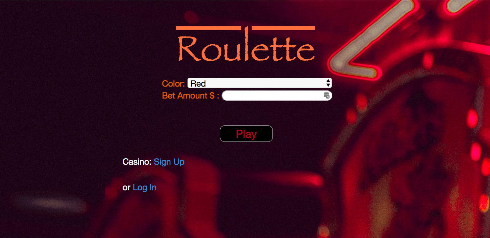

## ROULETTE APP
This is an app that allows a casino owner keep track of the wins and losses from his casino throughout the day.

## Tools Used
CSS, HTML, JavaScript, Node JS, MongoDB

## Installation

1. Clone repo
2. run `npm install`

## Usage

1. run `node server.js`
2. Navigate to `localhost:3030`

## Credit

Modified from Scotch.io's auth tutorial
